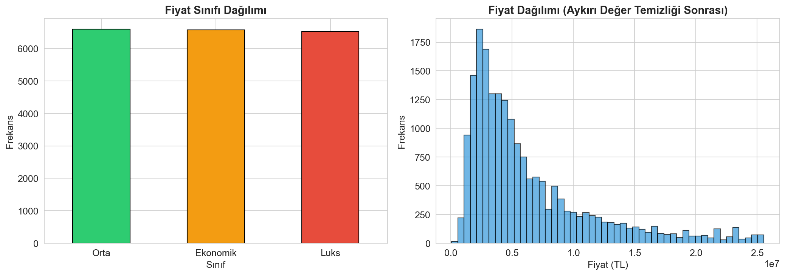
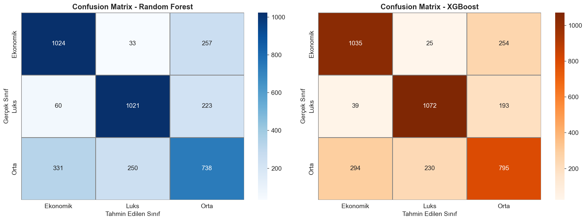
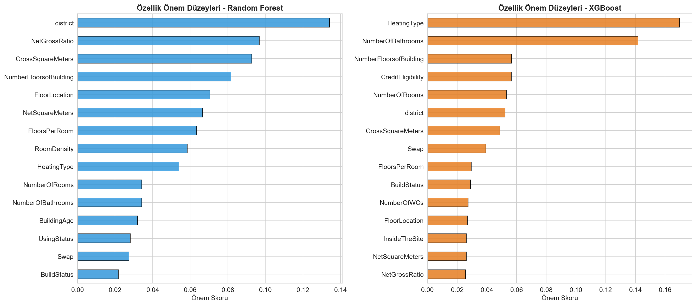
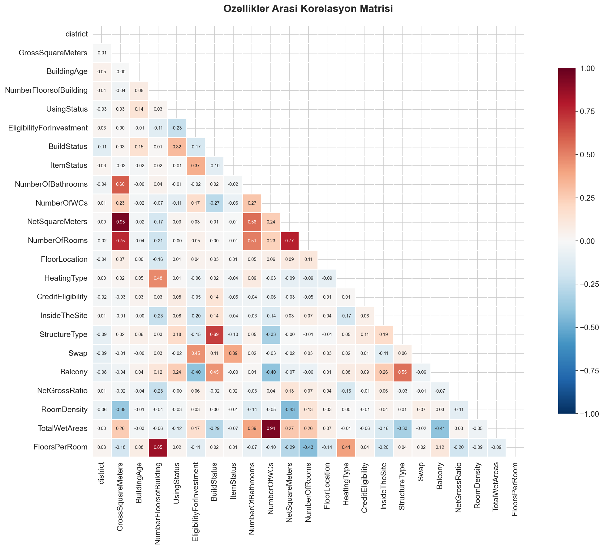
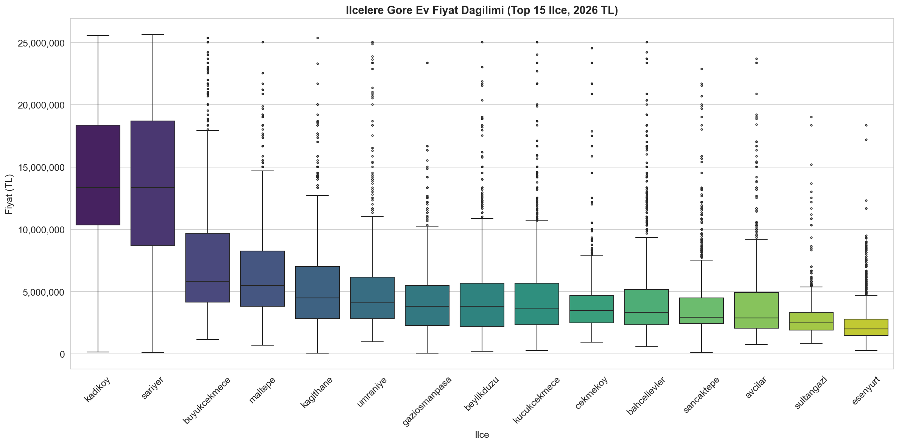
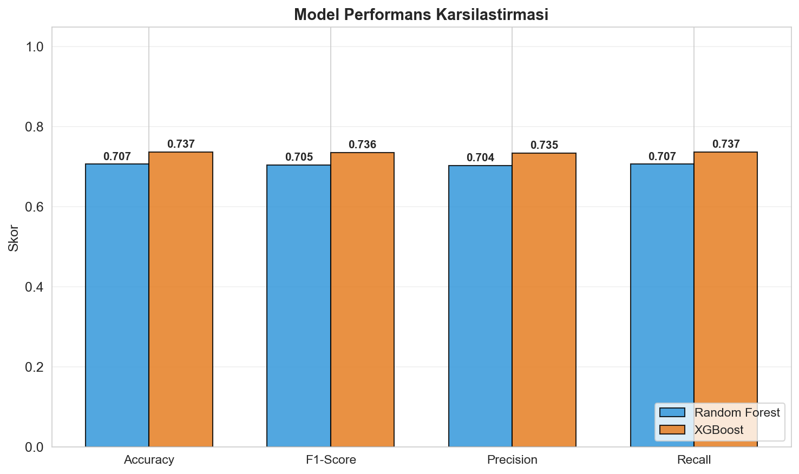
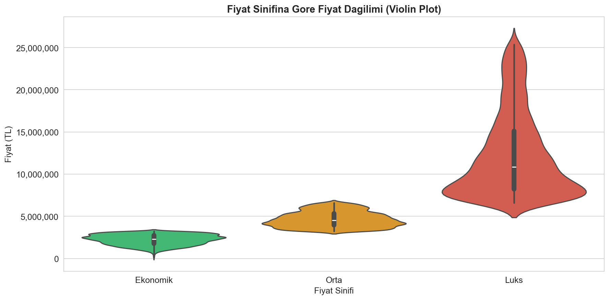
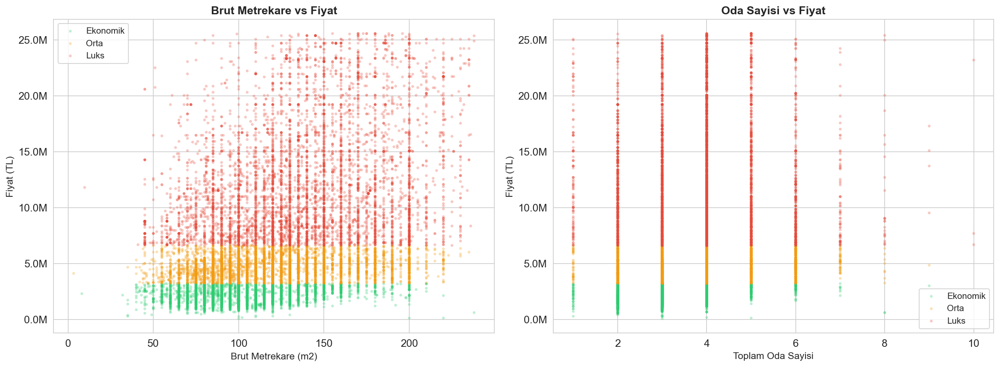
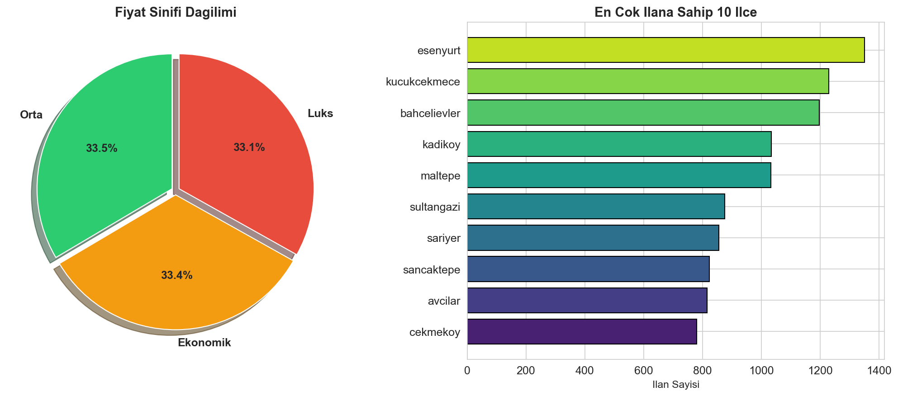
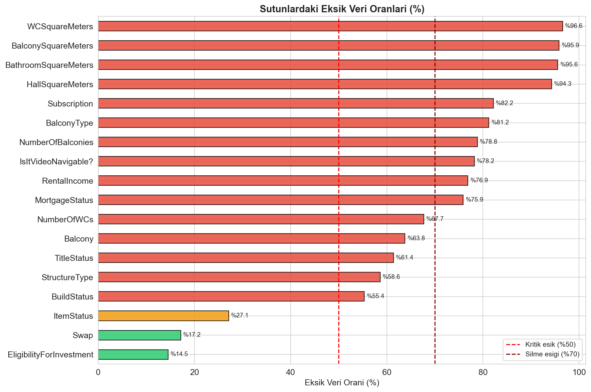

# 🏠 Makine Öğrenmesi Final Projesi — Ev Fiyat Tahmin Sınıflandırması

> **Ders:** Makine Öğrenmesi  
> **Konu:** İstanbul Konut Veri Seti Üzerinde Fiyat Sınıflandırması  
> **Veri Seti:** [House Price Dataset (Kaggle)](https://www.kaggle.com/datasets/aselasel/house-price-dataset)  
> **Tarih:** Nisan 2026

---

## 📋 İçindekiler

1. [Proje Özeti](#-proje-özeti)
2. [Veri Seti Hakkında](#-veri-seti-hakkında)
3. [Kurulum ve Çalıştırma](#-kurulum-ve-çalıştırma)
4. [İş Akışı (Pipeline)](#-iş-akışı-pipeline)
   - [Veri Ön İşleme](#1-veri-ön-i̇şleme-preprocessing)
   - [Enflasyon Düzeltmesi](#2-enflasyon-düzeltmesi)
   - [Özellik Mühendisliği](#3-özellik-mühendisliği-feature-engineering)
   - [Sınıflandırma Dönüşümü](#4-sınıflandırma-dönüşümü)
   - [Encoding ve Ölçeklendirme](#5-encoding-ve-ölçeklendirme)
   - [Model Eğitimi](#6-model-eğitimi)
   - [Değerlendirme](#7-değerlendirme-ve-karşılaştırma)
5. [Sonuçlar](#-sonuçlar)
6. [Görselleştirmeler](#-görselleştirmeler)
7. [Teknik Analiz](#-teknik-analiz)
8. [Proje Yapısı](#-proje-yapısı)
9. [Kullanılan Kütüphaneler](#-kullanılan-kütüphaneler)

---

## 📌 Proje Özeti

Bu projede, Türkiye'nin en büyük emlak ilanı sitesinden toplanmış **İstanbul satılık konut** verisi kullanılarak bir **makine öğrenmesi sınıflandırma** uygulaması geliştirilmiştir. 

Sürekli bir değişken olan **fiyat (price)**, `pd.qcut` yöntemiyle **3 sınıfa** (Ekonomik, Orta, Lüks) ayrılarak problem bir **çok sınıflı sınıflandırma problemine** dönüştürülmüştür. İki farklı sınıflandırıcı — **Random Forest** ve **XGBoost** — eğitilmiş, performansları karşılaştırmalı olarak değerlendirilmiştir.

Ek olarak, 2021-2022 yıllarına ait olan orijinal fiyatlar **TÜİK enflasyon verileriyle 2026 yılına güncellenmiştir**.

---

## 📊 Veri Seti Hakkında

| Özellik | Değer |
|---------|-------|
| **Kaynak** | Kaggle — [aselasel/house-price-dataset](https://www.kaggle.com/datasets/aselasel/house-price-dataset) |
| **Bölge** | İstanbul, Türkiye |
| **Toplam Satır** | ~25,000 gözlem |
| **Toplam Sütun** | 38 özellik |
| **Hedef Değişken** | `price` → 3 sınıfa dönüştürüldü |
| **Veri Toplama** | Python (requests + BeautifulSoup) ile web scraping |
| **Tarih** | 2021–2022 yılları |

### Önemli Sütunlar

| Sütun | Açıklama | Tip |
|-------|----------|-----|
| `district` | Evin bulunduğu ilçe (39 ilçe) | Kategorik |
| `price` | Satış fiyatı (TL) | Sayısal (hedef) |
| `GrossSquareMeters` | Brüt metrekare | Sayısal |
| `NetSquareMeters` | Net metrekare | Sayısal |
| `NumberOfRooms` | Oda sayısı (3+1 formatında) | Kategorik → Sayısal |
| `BuildingAge` | Bina yaşı (aralık formatında) | Kategorik → Ordinal |
| `NumberFloorsofBuilding` | Bina kat sayısı | Sayısal |
| `NumberOfBathrooms` | Banyo sayısı | Sayısal |
| `HeatingType` | Isıtma türü | Kategorik |
| `FloorLocation` | Dairenin bulunduğu kat | Kategorik |
| `InsideTheSite` | Site içinde mi? | İkili (Evet/Hayır) |

---

## 🚀 Kurulum ve Çalıştırma

### Gereksinimler

- Python 3.10+
- pip

### Adım Adım Kurulum

```bash
# 1. Sanal ortam oluştur
python -m venv venv

# 2. Sanal ortamı aktifleştir
# Windows:
.\venv\Scripts\activate
# Linux/Mac:
source venv/bin/activate

# 3. pip'i güncelle
python -m pip install --upgrade pip

# 4. Gerekli kütüphaneleri yükle
pip install -r requirements.txt

# 5. Scripti çalıştır
# Windows (PowerShell):
$env:PYTHONIOENCODING="utf-8"; python main.py

# Linux/Mac:
PYTHONIOENCODING=utf-8 python ev_fiyat_siniflandirma.py
```

> **Not:** Veri seti `kagglehub` kütüphanesi aracılığıyla otomatik olarak indirilir. Manuel indirme gerekmez.

### ☁️ Streamlit Cloud Dağıtımı

Bu repo Streamlit Cloud için `requirements.txt` ve `runtime.txt` ile hazırdır.

1. Repo'yu GitHub'a push et.
2. Streamlit Cloud'da **New app** ile `streamlit_app.py` dosyasını seç.
3. `HouseData.csv` dosyasını repoya ekle **veya** Kaggle erişimi sağla.

> Cloud'da `ModuleNotFoundError: plotly` hatası için bağımlılıklar `requirements.txt` üzerinden otomatik kurulur.
> Varsayılan olarak **kalite modu** aktiftir (tam veriyle eğitim). Yalnızca açılış süresi sorunu yaşarsan Streamlit Cloud Secrets/Environment'ta `FAST_MODE=1` vererek hızlı moda geçebilirsin.

---

## ⚙ İş Akışı (Pipeline)

### 1. Veri Ön İşleme (Preprocessing)

#### 1.1 Gereksiz Sütunların Çıkarılması

Aşağıdaki sütunlar modele katkı sağlamadığı veya çok yüksek eksik veri oranına sahip olduğu için çıkarıldı:

| Çıkarılan Sütun | Sebep |
|-----------------|-------|
| `Unnamed: 0` | Anlamsız index |
| `address` | Çok yüksek kardinalite |
| `AdUpdateDate` | Tarih — model için gereksiz |
| `Category`, `Type` | Tüm değerler aynı (Satılık, Konut) |
| `HallSquareMeters`, `WCSquareMeters` | >%90 eksik veri |
| `BathroomSquareMeters`, `BalconySquareMeters` | >%90 eksik veri |
| `Subscription`, `BalconyType`, `NumberOfBalconies` | >%70 eksik veri |

> **Önemli:** `AdCreationDate` sütunu enflasyon düzeltmesi için geçici olarak tutulmuş, işlem sonrası silinmiştir.

#### 1.2 Fiyat Sütunu Temizleme

Fiyat sütunu `"3,100,000TL"` formatındaydı. Şu adımlarla sayısala dönüştürüldü:

```python
df["price"] = df["price"].str.replace("TL", "").str.replace(",", "").str.strip()
df["price"] = pd.to_numeric(df["price"], errors="coerce")
```

- Dönüşüm sonrası **1,333 satırda NaN** oluştu → bu satırlar silindi.

#### 1.3 Sayısal Sütunların Temizlenmesi

- `GrossSquareMeters`, `NetSquareMeters`: `"160 m2"` → `160` (birim kaldırıldı)
- `NumberOfBathrooms`, `NumberOfWCs`: String → int dönüşümü
- `NumberOfRooms`: `"3+1"` → `4`, `"8+ Oda"` → `8` (özel parse fonksiyonu)
- `BuildingAge`: `"5-10"` → `7`, `"21 Ve Üzeri"` → `25` (ordinal mapping)

#### 1.4 Eksik Değer (NaN) Yönetimi

| Strateji | Uygulama |
|----------|----------|
| **Sayısal sütunlar** | **Medyan** ile dolduruldu |
| **Kategorik sütunlar** | **Mod** (en sık değer) ile dolduruldu |
| **%70+ eksik sütunlar** | Tamamen silindi |

#### 1.5 Aykırı Değer (Outlier) Temizliği — IQR Yöntemi

`price`, `GrossSquareMeters` ve `NetSquareMeters` sütunlarında **IQR (Interquartile Range)** yöntemi kullanıldı:

```
Alt Sınır = Q1 - 1.5 × IQR
Üst Sınır = Q3 + 1.5 × IQR
```

| Sütun | Q1 | Q3 | IQR | Silinen Aykırı Değer |
|-------|:---:|:---:|:---:|:---:|
| `price` | 3,007,084 | 12,028,336 | 9,021,252 | 2,546 |
| `GrossSquareMeters` | 91 | 150 | 59 | 1,163 |
| `NetSquareMeters` | 80 | 125 | 45 | 431 |

**Toplam:** 23,822 → **19,682 satır** (4,140 aykırı değer silindi)

---

### 2. Enflasyon Düzeltmesi

Veri seti 2021-2022 yıllarına ait olduğundan fiyatlar güncel değildi. TÜİK verilerine göre **kümülatif enflasyon çarpanı** hesaplanarak fiyatlar **2026 Nisan değerine** güncellendi.

#### Kullanılan TÜFE Oranları (TÜİK)

| Yıl | Yıllık TÜFE (%) | Kaynak |
|:---:|:---:|:---:|
| 2022 | %64.27 | TÜİK |
| 2023 | %64.77 | TÜİK |
| 2024 | %44.38 | TÜİK |
| 2025 | %30.65 | TÜİK |
| 2026 (Q1) | %7.50 (tahmini) | TÜİK / Anadolu Ajansı |

#### Kümülatif Enflasyon Çarpanları

| İlan Yılı | → 2026 Çarpanı | İlan Sayısı |
|:---------:|:--------------:|:-----------:|
| 2020 | ×7.14 | 449 |
| 2021 | ×5.49 | 7,937 |
| 2022 | ×3.34 | 15,302 |

#### Fiyat Güncelleme Sonucu

| Metrik | Orijinal Fiyat | 2026 Güncel Fiyat |
|--------|:-:|:-:|
| **Ortalama** | 5,052,525 TL | **23,180,448 TL** |
| **Medyan** | 1,350,000 TL | **5,351,382 TL** |

---

### 3. Özellik Mühendisliği (Feature Engineering)

Mevcut özelliklerden **4 yeni türetilmiş özellik** oluşturuldu:

| Yeni Özellik | Formül | Açıklama |
|-------------|--------|----------|
| `NetGrossRatio` | Net m² / Brüt m² | Alan verimliliği göstergesi |
| `RoomDensity` | Oda sayısı / Net m² | Oda yoğunluğu |
| `TotalWetAreas` | Banyo + WC sayısı | Toplam ıslak alan |
| `FloorsPerRoom` | Bina katı / Oda sayısı | Kat-oda oranı |

> **Not:** `PricePerM2` (fiyat/metrekare) özelliği bilinçli olarak **eklenmedi** çünkü fiyat hedef değişkenimizdir. Fiyattan türetilen özellikler **data leakage** (veri sızıntısı) oluşturarak yapay olarak şişirilmiş skorlara yol açar.

---

### 4. Sınıflandırma Dönüşümü

Sürekli fiyat değişkeni `pd.qcut` ile **3 eşit frekanslı sınıfa** bölündü:

```python
df["PriceClass"] = pd.qcut(df["price"], q=3, labels=["Ekonomik", "Orta", "Luks"])
```

| Sınıf | Fiyat Aralığı (2026 TL) | Gözlem Sayısı |
|:-----:|:---:|:---:|
| **Ekonomik** | 66,824 – 3,224,262 | 6,566 |
| **Orta** | 3,232,783 – 6,586,316 | 6,595 |
| **Lüks** | 6,598,879 – 25,560,214 | 6,521 |

`pd.qcut` kullanılarak sınıflar **dengeli** dağıtıldı (~%33 her sınıf).

---

### 5. Encoding ve Ölçeklendirme

#### 5.1 Kategorik Değişken Encoding

İki farklı encoding stratejisi uygulandı:

| Yöntem | Uygulanan Sütunlar | Sebep |
|--------|-------------------|-------|
| **Frequency Encoding** | `district` (39 ilçe) | Yüksek kardinaliteli sırasız değişken. Label Encoding yapay sıralama oluşturur; frekans encoding her ilçeyi veri setindeki oranıyla temsil eder. |
| **Label Encoding** | Diğer 11 kategorik sütun | Düşük kardinaliteli değişkenler (2-15 kategori) |

#### 5.2 Özellik Ölçeklendirme

Tüm özellikler **StandardScaler** ile ölçeklendirildi:

```python
scaler = StandardScaler()
X_df_scaled = scaler.fit_transform(X_df)
```

Bu işlem, farklı ölçeklerdeki değişkenlerin (m² vs oda sayısı) model performansını olumsuz etkilemesini önler.

#### 5.3 Final Özellik Listesi (23 özellik)

```
district, GrossSquareMeters, BuildingAge, NumberFloorsofBuilding,
UsingStatus, EligibilityForInvestment, BuildStatus, ItemStatus,
NumberOfBathrooms, NumberOfWCs, NetSquareMeters, NumberOfRooms,
FloorLocation, HeatingType, CreditEligibility, InsideTheSite,
StructureType, Swap, Balcony, NetGrossRatio, RoomDensity,
TotalWetAreas, FloorsPerRoom
```

---

### 6. Model Eğitimi

Veri **%80 eğitim / %20 test** olarak bölündü (`stratify=y` ile dengeli):

- **Eğitim seti:** 15,745 örnek
- **Test seti:** 3,937 örnek

#### 6.1 Random Forest Classifier (Optimize Edilmiş)

```python
RandomForestClassifier(
    n_estimators=500,        # 500 karar ağacı
    max_depth=30,            # Maksimum ağaç derinliği
    min_samples_split=3,     # Düğüm bölünme eşiği
    min_samples_leaf=1,      # Yaprak düğüm minimum örneği
    max_features="sqrt",     # Her bölünmede kullanılan özellik sayısı
    class_weight="balanced", # Sınıf dengesizliğini telafi eder
    random_state=42,
    n_jobs=-1                # Tüm CPU çekirdeklerini kullan
)
```

#### 6.2 XGBoost Classifier (Optimize Edilmiş)

```python
XGBClassifier(
    n_estimators=500,        # 500 boosting turası
    max_depth=10,            # Ağaç derinliği
    learning_rate=0.05,      # Düşük öğrenme oranı → daha iyi genelleme
    subsample=0.85,          # Her turda kullanılan veri oranı
    colsample_bytree=0.85,   # Her turda kullanılan özellik oranı
    min_child_weight=3,      # Overfitting önleme
    gamma=0.1,               # Minimum kayıp azalması
    reg_alpha=0.1,           # L1 regularization
    reg_lambda=1.0,          # L2 regularization
    eval_metric="mlogloss",
    random_state=42
)
```

---

### 7. Değerlendirme ve Karşılaştırma

Her iki model için **Accuracy**, **F1-Score**, **Precision** ve **Recall** metrikleri hesaplandı:

---

## 📈 Sonuçlar

### Model Performans Karşılaştırması

| Metrik | Random Forest | XGBoost | Fark (XGB - RF) |
|--------|:---:|:---:|:---:|
| **Accuracy** | %70.69 | **%73.71** | +%3.02 |
| **F1-Score** | 0.7047 | **0.7355** | +0.031 |
| **Precision** | 0.7039 | **0.7345** | +0.031 |
| **Recall** | 0.7069 | **0.7371** | +0.030 |

### 🏆 Kazanan Model: **XGBoost** — Tüm metriklerde ~%3 daha yüksek performans

### Sınıf Bazlı Detaylı Sonuçlar (XGBoost)

| Sınıf | Precision | Recall | F1-Score | Destek |
|:-----:|:---------:|:------:|:--------:|:------:|
| **Ekonomik** | 0.76 | 0.79 | 0.77 | 1,314 |
| **Lüks** | 0.81 | 0.82 | 0.81 | 1,304 |
| **Orta** | 0.64 | 0.60 | 0.62 | 1,319 |

> **Gözlem:** "Orta" sınıfı en düşük performansı göstermektedir. Bu beklenen bir durumdur çünkü orta segment, hem ekonomik hem lüks sınıfla fiyat aralığı açısından örtüşme bölgesine sahiptir.

---

## 📊 Görselleştirmeler ve Yorumları

Projede toplam **10 adet görselleştirme** oluşturulmuştur. Her biri farklı bir analiz boyutunu ortaya koyar.

---

### 1. 📉 Fiyat Sınıfı Dağılımı ve Histogram



**Yorum:**
- **Sol grafik (bar chart):** `pd.qcut` kullanıldığı için üç sınıf (Ekonomik, Orta, Lüks) neredeyse eşit dağılıma sahiptir (~6,500'er gözlem). Bu, modelin belirli bir sınıfa yanlı (bias) öğrenmesini engeller. Eğer sınıflar dengesiz olsaydı model çoğunluk sınıfını tahmin etmeye meyilli olurdu.
- **Sağ grafik (histogram):** Fiyat dağılımı **sağa çarpık (right-skewed)** bir yapıdadır — çoğu ev düşük-orta fiyat bandında yoğunlaşırken, az sayıda yüksek fiyatlı ev dağılımın kuyruğunu oluşturmaktadır. Bu, İstanbul emlak piyasasının doğasını yansıtır: az sayıda lüks konut, çok sayıda standart konut.

---

### 2. 🔴 Confusion Matrix (Karmaşıklık Matrisi)



**Yorum:**
- **Köşegen değerler** (sol üst → sağ alt) doğru tahminleri gösterir. Yüksek köşegen = iyi model.
- **Random Forest:** Ekonomik sınıfı 1,024 kez doğru tahmin ederken, 257 kez yanlışlıkla "Orta" olarak sınıflandırmış. Bu, iki komşu sınıf arasındaki fiyat sınırının belirsiz olduğunu gösterir.
- **XGBoost:** Tüm köşegen değerleri RF'den yüksek — özellikle Lüks sınıfında 1,072 doğru tahmin (RF'de 1,021). XGBoost, sınıf sınırlarını daha keskin çizebilmiştir.
- **Orta sınıfı** her iki modelde de en düşük performansa sahip. Bunun sebebi, Orta segmentin hem Ekonomik hem Lüks sınıfla fiyat aralığı açısından **örtüşme bölgesine** sahip olmasıdır — bu, sınıflandırma problemlerinde "sınır bölgesi" (decision boundary) zorluğu olarak bilinir.

---

### 3. 📊 Özellik Önem Düzeyleri (Feature Importance)



**Yorum:**
- **Random Forest** için en önemli özellik `district` (ilçe, %13.4). Bu mantıklıdır çünkü İstanbul'da ilçe konum bilgisi fiyatı doğrudan belirler (Beşiktaş vs Esenyurt). İkinci sırada `NetGrossRatio` (%9.7) var — bu bizim türettiğimiz bir özellik olup, net/brüt m² oranı yüksek evlerin genellikle daha kaliteli ve pahalı olduğunu gösterir.
- **XGBoost** için en belirleyici özellik `HeatingType` (ısıtma türü, %17). Bu ilginçtir çünkü merkezi ısıtma sistemine sahip binalar genellikle lüks sitelerdedir. İkinci sırada `NumberOfBathrooms` (%14.2) — birden fazla banyosu olan evler tipik olarak daha büyük ve pahalıdır.
- **İki model farklı özelliklere odaklanması** normal ve beklenen bir durumdur: RF rastgele örneklemeyle tüm özelliklere eşit şans verirken, XGBoost hata azaltmaya en çok katkı sağlayan özelliklere yoğunlaşır.

---

### 4. 🌡️ Korelasyon Isı Haritası (Correlation Heatmap)



**Yorum:**
- Korelasyon matrisi, tüm sayısal özellikler arasındaki **doğrusal ilişki gücünü** gösterir. Değerler -1 ile +1 arasındadır.
- **Güçlü pozitif korelasyonlar (koyu kırmızı):**
  - `GrossSquareMeters` ↔ `NetSquareMeters` (~0.93): Brüt ve net metrekare birbirine çok yakın → bu beklenen bir durum, ama ikisini birden modelde tutmak çoklu doğrusallık (multicollinearity) oluşturabilir.
  - `NumberOfBathrooms` ↔ `TotalWetAreas`: Tanım gereği yüksek korelasyon.
- **Dikkat edilmesi gereken:** Çok yüksek korelasyonlu özellik çiftleri (>0.9) modelin kararlılığını azaltabilir. Ancak ağaç tabanlı modeller (RF, XGBoost) korelasyona nispeten dayanıklıdır.
- **Zayıf korelasyonlar (beyaz/açık):** `BuildingAge`, `UsingStatus` gibi özellikler diğerleriyle düşük korelasyona sahip → bunlar bağımsız bilgi taşıyor ve modele çeşitlilik katıyor.

---

### 5. 🏘️ İlçelere Göre Fiyat Dağılımı (Boxplot)



**Yorum:**
- Bu grafik, en fazla ilana sahip **15 İstanbul ilçesinin** fiyat dağılımını gösterir. İlçeler medyan fiyata göre sıralanmıştır.
- **Yüksek fiyatlı ilçeler** (Beşiktaş, Kadıköy, Üsküdar): Bu ilçelerde kutu (box) daha yüksekte ve geniş → hem medyan fiyat yüksek hem de fiyat varyansı büyük. Yani bu ilçelerde hem orta hem de çok lüks evler mevcut.
- **Düşük fiyatlı ilçeler** (Esenyurt, Beylikdüzü): Kutu alçakta ve dar → fiyatlar daha homojen ve düşük.
- **Kutuların genişliği** (IQR): Geniş kutu = o ilçede çok farklı fiyat segmentlerinde ev var. Dar kutu = fiyatlar benzer.
- Bu grafik, `district` özelliğinin neden bu kadar önemli olduğunu görsel olarak doğrulamaktadır.

---

### 6. 📊 Model Performans Karşılaştırması (Bar Chart)



**Yorum:**
- Dört temel metriğin (Accuracy, F1-Score, Precision, Recall) iki model için yan yana karşılaştırması.
- **XGBoost (turuncu)** tüm metriklerde **Random Forest'tan (mavi)** üstün. Fark küçük ama tutarlıdır (~%3).
- **Metriklerin anlamları:**
  - **Accuracy:** Toplam doğru tahmin oranı. Genel başarıyı gösterir.
  - **F1-Score:** Precision ve Recall'un harmonik ortalaması. Dengeli bir performans ölçütüdür.
  - **Precision:** "Model Lüks dediğinde, gerçekten Lüks mü?" sorusuna cevap verir.
  - **Recall:** "Gerçek Lüks evlerin kaçını bulabildik?" sorusuna cevap verir.
- Dört metriğin birbirine yakın olması, modelin **dengeli** çalıştığını gösterir (bir sınıfı diğerine tercih etmiyor).

---

### 7. 🎻 Sınıf Bazlı Fiyat Dağılımı (Violin Plot)



**Yorum:**
- Violin plot, her sınıfın fiyat dağılımını **hem histogram (dış şekil)** hem de **boxplot (iç kutu)** olarak gösterir.
- **Ekonomik sınıf (yeşil):** Dağılım alçakta yoğunlaşmış ve dar → fiyatlar oldukça homojen.
- **Orta sınıf (turuncu):** Ortada konumlanmış, daha geniş bir dağılıma sahip → bu sınıftaki evlerin fiyatları daha değişken.
- **Lüks sınıf (kırmızı):** Dağılım yukarıda ve uzun kuyruklu → az sayıda çok yüksek fiyatlı ev mevcut.
- **İç kutular (beyaz dikdörtgen):** Her sınıfın medyan fiyatını ve IQR'ını gösterir. Sınıflar arasındaki medyan farkları net bir şekilde görülmektedir.
- Bu grafik, `pd.qcut`'un sınıfları nasıl ayırdığını ve her sınıfın iç yapısını ortaya koyar.

---

### 8. 🔵 Özellik İlişkisi (Scatter Plot)



**Yorum:**
- **Sol grafik (Brüt m² vs Fiyat):** Metrekare arttıkça fiyat artma eğilimi net şekilde görülmektedir. Ancak önemli olan nokta: **aynı metrekarede bile sınıflar örtüşmektedir.** Örneğin 120 m² bir ev hem Ekonomik hem Orta hem Lüks olabilir — çünkü ilçe, kat, bina yaşı gibi faktörler devreye giriyor. Bu, sadece metrekareyle fiyat tahmin etmenin yeterli olmadığını gösterir.
- **Sağ grafik (Oda Sayısı vs Fiyat):** Oda sayısı arttıkça fiyat genel olarak artıyor. 3-4 odalı evlerde (en yaygın segment) **üç sınıf ciddi şekilde örtüşüyor** — model için en zor bölge burasıdır. 6+ odalı evler büyük olasılıkla Lüks sınıfına aittir.
- **Renk kodlaması:** Yeşil = Ekonomik, Turuncu = Orta, Kırmızı = Lüks. Sınıflar arasındaki geçiş bölgelerinin genişliği, modelin neden %100 başarı sağlayamayacağını görsel olarak açıklar.

---

### 9. 🥧 Sınıf ve İlçe Dağılımı (Pie + Bar)



**Yorum:**
- **Sol (pasta grafik):** Üç sınıfın neredeyse eşit dağılımı (%33'er) `pd.qcut` yönteminin başarılı çalıştığını doğrular. Dengeli sınıflar, modelin her sınıfı eşit öğrenmesini sağlar.
- **Sağ (bar grafik):** En çok ilana sahip ilçeler sıralanmıştır. Bu, veri setinin İstanbul genelinde hangi bölgelere ağırlık verdiğini gösterir. Bazı ilçelerin çok az temsil edilmesi, modelin o ilçeler için daha az güvenilir tahmin üretmesine neden olabilir.

---

### 10. 🟡 Eksik Veri Haritası



**Yorum:**
- **Renk kodlaması:** 🟢 Yeşil (%0-20 eksik), 🟡 Turuncu (%20-50 eksik), 🔴 Kırmızı (%50+ eksik).
- **Kırmızı çizgi (%50):** Kritik eşik. Bu oranın üzerindeki sütunlarda veri doldurmak güvenilir değildir.
- **Koyu kırmızı çizgi (%70):** Bizim silme eşiğimiz. Bu oranın üzerindeki sütunlar tamamen çıkarılmıştır.
- **En çok eksik veri:** `BathroomSquareMeters` (%96), `BalconySquareMeters` (%96), `WCSquareMeters` (%97) — bu sütunlar neredeyse tamamen boş olduğundan modele katkısı olamazdı.
- **Düşük eksik veri:** `NumberOfBathrooms`, `BuildingAge` gibi sütunlarda eksik oranı %5-15 arasında → bunlar medyan/mod ile güvenle doldurulabilir.
- Bu grafik, veri kalitesini hızlıca değerlendirmek ve hangi sütunların kullanılabilir olduğuna karar vermek için önemlidir.

---

## 📁 Proje Yapısı

```
ev-fiyat-tahmin/
├── main.py                      # Ana Python scripti (tüm pipeline + görseller)
├── README.md                    # Bu dosya
├── sinif_dagilimi.png           # Fiyat sınıfı dağılım grafiği
├── confusion_matrix.png         # Karmaşıklık matrisleri
├── feature_importance.png       # Özellik önem düzeyleri
├── korelasyon_haritasi.png      # Korelasyon ısı haritası
├── ilce_fiyat_dagilimi.png      # İlçelere göre fiyat boxplot
├── model_karsilastirma.png      # Model metrik karşılaştırması
├── sinif_violin_plot.png        # Violin plot (sınıf bazlı)
├── ozellik_scatter.png          # Scatter plot (m² & oda vs fiyat)
├── sinif_ve_ilce_dagilimi.png   # Pasta grafik + ilçe dağılımı
├── eksik_veri_haritasi.png      # Eksik veri oranları
├── venv/                        # Python sanal ortam
└── HouseData.csv                # Veri seti (kagglehub ile otomatik indirilir)
```

---

## 📦 Kullanılan Kütüphaneler

| Kütüphane | Versiyon | Kullanım Amacı |
|-----------|:--------:|---------------|
| `pandas` | 3.0.2 | Veri manipülasyonu ve analiz |
| `numpy` | 2.4.4 | Sayısal hesaplamalar |
| `scikit-learn` | 1.8.0 | ML modelleri, metrikler, preprocessing |
| `xgboost` | 3.2.0 | XGBoost sınıflandırıcı |
| `matplotlib` | 3.10.9 | Grafik ve görselleştirme |
| `seaborn` | 0.13.2 | İstatistiksel görselleştirme |
| `kagglehub` | 1.0.0 | Kaggle veri seti indirme |

---

## 📜 Lisans

Bu proje eğitim amaçlı hazırlanmıştır. Veri seti [Kaggle](https://www.kaggle.com/datasets/aselasel/house-price-dataset) üzerinden kamuya açık olarak paylaşılmıştır.
